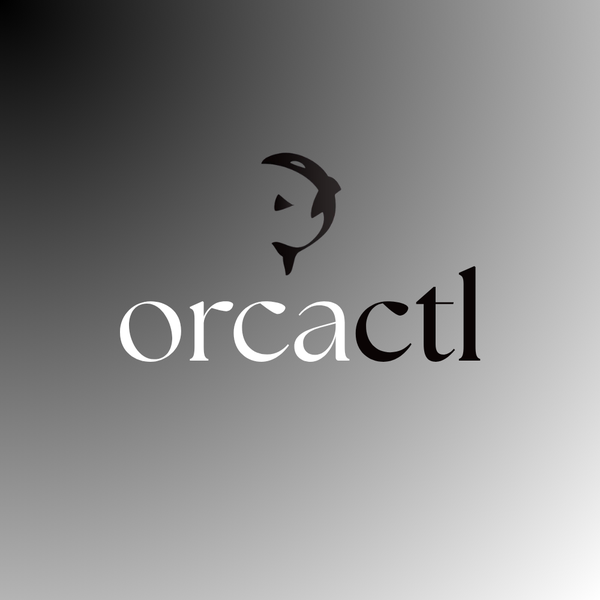
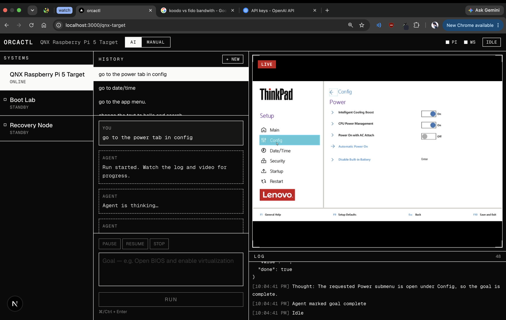
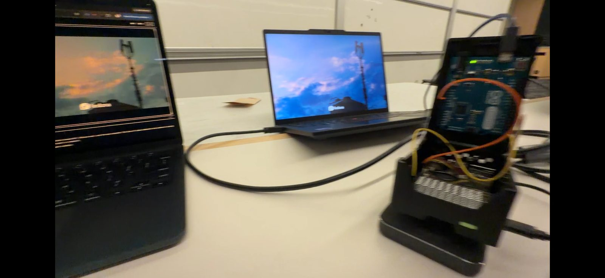
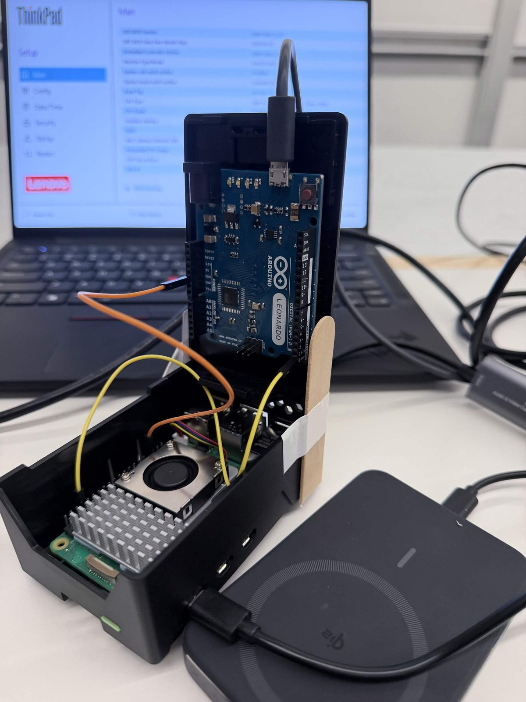

<div align="center">



# orcactl

**An AI agent with eyes and hands on a machine that has no operating system.**

[Demo video](https://youtu.be/W0umiOq4xsg) · [Hack the North 2026](https://hackthenorth.com)

</div>

---

## Inspiration

During a major data-center outage, tens to hundreds of servers can end up bricked or unreachable by every remote tool that lives inside an OS. A bad firmware or kernel update is enough. SSH is gone, the remote desktop is gone, and the fix is a technician walking to the rack with a monitor and a keyboard.

AI coding agents have the same ceiling. They can write code, run commands, read a stack trace — but only inside an operating system. The moment the failure is *below* the OS, a corrupted bootloader, a BIOS setting, a reinstall, the agent has nothing to act inside.

IP-KVM already solves the remote half of this: see and control a machine over the network when SSH is not an option. But a human is still doing the clicking. orcactl is the next step.

## What it does

orcactl plugs into a machine through its **hardware**: it reads the screen over HDMI and acts as a **USB keyboard and mouse**.

Because the connection is physical, the target needs **no software, no agent and no network**. It works on a machine that has never been configured, is mid-reinstall, or is sitting at a BIOS prompt with no OS at all.

Give it a goal and it iterates on its own — capture the screen, decide, send input, verify what changed, repeat. One controller can be pointed at several machines to triage them together.

<div align="center">
  
  <br><em>Live target screen, agent reasoning, and the action log</em>
</div>

## How we built it

<div align="center">
  
  <br><em>Operator laptop (left), target machine (centre), orcactl controller (right)</em>
</div>

```
                HDMI                         USB (keyboard + mouse)
  target  ───────────────►  capture card          ▲
     ▲                           │                │
     └───────────────────────────┼────────────────┘
                                 ▼                │
                    ┌──────────────────────────────────────┐
                    │  Raspberry Pi 5 · QNX                │
                    │  kvmd (C): frames ─► MJPEG over HTTP │
                    │            /key   ─► UART            │
                    └───────────────┬──────────────────────┘
                          GPIO UART │  (Pi TX → Leonardo RX + GND)
                    ┌───────────────▼──────────────────────┐
                    │  Arduino Leonardo · C++ firmware     │
                    │  HID-Project, boot protocol          │
                    └──────────────────────────────────────┘
                                 ▲
                    HTTP         │
  Go + Gin backend ──────────────┘         Next.js dashboard
  OpenAI vision agent                      MJPEG + WebSocket
```

**The QNX layer.** A Raspberry Pi 5 running QNX sits between the agent and the machine, owning both directions. We wrote a C daemon, `kvmd`, that pulls frames from the capture card through the QNX sensor framework, encodes them as JPEG and streams them over HTTP as MJPEG. The same daemon exposes `POST /key`, validates every command against an allowlist, and forwards it down the UART.

**Why there is an Arduino.** The Pi 5 cannot act as a USB peripheral — its ports are host-only and the QNX BSP has no device-controller driver — so it cannot pretend to be a keyboard. Input commands are forwarded over the Pi's GPIO UART to an Arduino Leonardo running our C++ firmware, which maps them to real USB keystrokes and mouse coordinates. We use NicoHood's HID-Project library so the board presents as a **boot-protocol** device, which is what firmware expects and is the reason it works in BIOS and UEFI menus.

<div align="center">
  
  <br><em>Inside the controller — Leonardo on top, Pi 5 underneath, joined by three jumper wires</em>
</div>

**The web layer.** A Next.js client hosts the dashboard; a Go backend on Gin relays video, holds the WebSocket to the browser and drives the agent loop. Screenshots go to the OpenAI API, which builds context on what is on screen.

**The agent.** In autonomous mode a master agent drafts a plan, then a vision model works through it step by step, confirming from the next frame that each step actually landed before moving on.

## Challenges we ran into

- **QNX is not Linux.** Getting libraries to build and code to cross-compile took real time.
- **The Pi 5 cannot be a USB device**, which we found out the hard way. That pivot is why the Leonardo is in the design at all.
- **Networking between four moving parts** — Pi, target, backend and two laptops — on venue Wi-Fi.

## Accomplishments that we're proud of

Building a genuine embedded system, and then watching our own hardware agent drive a machine remotely from a laptop across the table.

## What we learned

The QNX development environment, and how to design an AI agent that acts on the physical world instead of an API.

## What's next for orcactl

Running against many machines at once.

---

## Repository

| Path | What |
|---|---|
| `embedded/qnx/kvmd.c` | QNX daemon: capture card → MJPEG over HTTP, and `POST /key` → UART |
| `embedded/qnx/kvm_setup.sh` | Brings up the GPIO UART (`/dev/ser1`) and the capture card sensor |
| `embedded/kvm_keyboard/` | Arduino Leonardo firmware: serial commands → USB keyboard and mouse |
| `backend/` | Go + Gin: video relay, dashboard WebSocket, agent loop, OpenAI client |
| `frontend/` | Next.js dashboard: live screen, chat, action log, manual control |

## Hardware

- Raspberry Pi 5 running QNX
- Arduino Leonardo (any ATmega32U4 board with native USB)
- HDMI capture card (UVC)
- 3 jumper wires: **Pi pin 8 (GPIO14 TX) → Leonardo RX**, **Pi pin 6 (GND) → Leonardo GND**

> Do not wire the Leonardo's 5 V TX back to the Pi — Pi 5 GPIO is not 5 V tolerant.

The Leonardo's USB goes to the target machine; the capture card takes the target's HDMI.

## Running it

**1. Flash the Leonardo.** Install the **HID-Project** library (Library Manager → "HID-Project"), then upload `embedded/kvm_keyboard/kvm_keyboard.ino` with the board set to *Arduino Leonardo*.

**2. Start the Pi.** Over ssh:

```bash
sudo ./kvm_setup.sh          # UART + capture card
./kvmd -w 720 -h 480 -p 8080 -q 80 -s /dev/ser1
```

Check it: `http://<pi>:8080/stream` should show the target's screen, and `http://<pi>:8080/ui` is a built-in control page, handy for testing without the dashboard.

**3. Backend.**

```bash
cd backend && cp .env.example .env
```

Set `OPENAI_API_KEY` and point `QNX_BASE_URL` at the Pi, then:

```bash
cd backend && go run .
```

**4. Dashboard.**

```bash
cd frontend && bun install && bun dev
```

Open <http://localhost:3000>.

> In development the dashboard WebSocket connects straight to Go rather than through the Next rewrite, which drops the upgrade. Put `NEXT_PUBLIC_BACKEND_ORIGIN=http://localhost:8080` in `frontend/.env.local`.

## Serial protocol

`POST /key` takes one command per line. The QNX daemon validates each one before it reaches the Leonardo.

| Command | Meaning |
|---|---|
| `k<hex>` | tap a key — `kB0` Enter, `kC3` F2, `k61` `a` |
| `p<hex>` / `r<hex>` | press and hold / release |
| `t<text>` | type a string |
| `a` | release every key |
| `m<dx>,<dy>[,<wheel>]` | move the mouse, relative |
| `m<XXXX><YYYY>` | move the mouse, absolute (8 hex digits, each axis `0000`–`7FFF`) |
| `b<L\|R\|M><d\|u\|c>` | button down / up / click — `bLc` is a left click |
| `w<n>` | scroll wheel, signed |
| `z` | release every mouse button |

Key codes are USB HID bytes: `B0` Enter, `B1` Esc, `B2` Backspace, `B3` Tab, `20` Space, `C2`–`CD` F1–F12, `D7`/`D8`/`D9`/`DA` arrows, `80`–`83` left Ctrl/Shift/Alt/GUI. Printable characters use ASCII.

## Built with

QNX · Raspberry Pi 5 · Arduino · C · C++ · Go · Gin · Next.js · React · TypeScript · Tailwind · OpenAI API · HID-Project

Built at Hack the North 2026.
